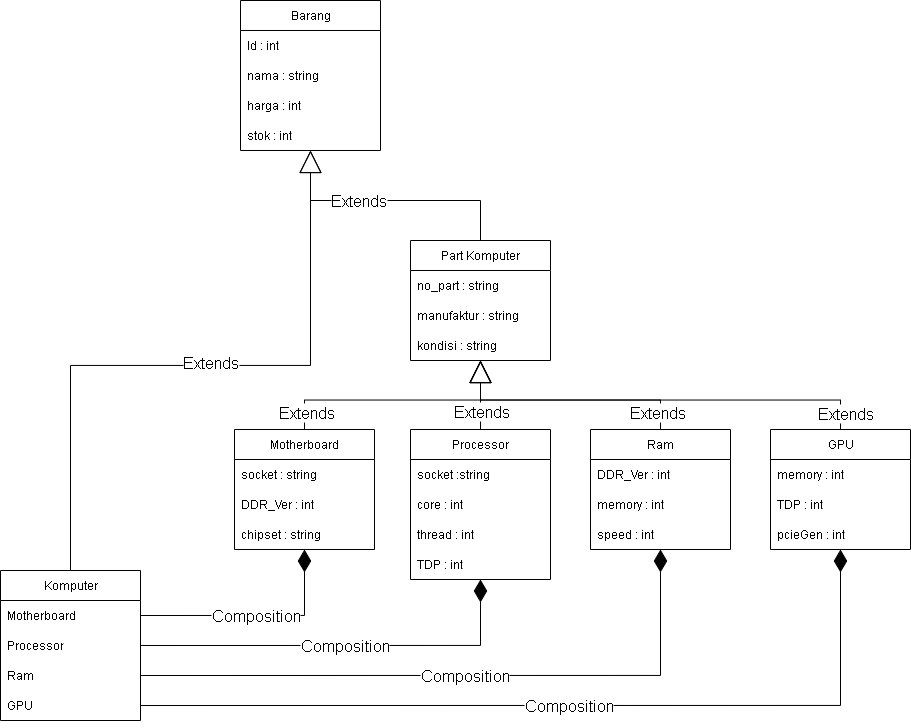
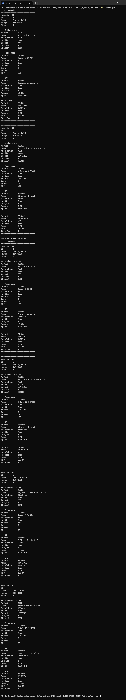

# Tugas Praktikum 3
## Janji
Saya Muhammad Attala Rafikasya dengan NIM 2403310 mengerjakan Tugas Praktikum 3 dalam mata kuliah Desain Pemrograman Berbasis Objek untuk keberkahanNya maka saya tidak melakukan kecurangan seperti yang telah dispesifikasikan.

## Diagram

## Desain Program
Program terdiri dari 7 class. Program ini menggunakan Hybrid Inheritance yang terdiri dari Multilevel Inheritance (pada kelas Motherboard, Processor, Ram, dan GPU) dan Hierarchical Inheritance (pad kelas PartKomputer dan Komputer). Di dalam class Komputer tedapat composition yang terdiri dari class Motherboard, Processor, Ram, dan GPU.

## Penjelasan Kelas
### Barang
#### Attribute
- int id
    Menyimpan id barang.
- string nama
    Menyimpan nama barang.
- int harga
    Menyimpan harga barang.
- int stok
    Menyimpan stok barang.
#### Method
- Getter and  Setter untuk semua atribut.

### PartKomputer extend Barang
#### Attribute
- string noPart
    Menyimpan noPart PartKomputer. String karena ada noPart yang memiliki huruf (e.g. LM220WE1).
- string manufaktur
    Meyimpan nama manufaktur pembuatan partkomputer.
- string 
    Menyimpan kondisi barang (i.e. "Baru" atau "Bekas").
#### Method
- Getter and  Setter untuk semua atribut.

### Motherboard extend PartKomputer
#### Attribute
- string socket
    Menyimpan socket motherboard (e.g. AM4).
- int DDR_Ver
    Menyimpan versi DDR yang digunakan motherboard (e.g. DDR3, DDR 4).
- string chipset
    Menyimpan chipset yang digunakan (e.g. B450, A320).
#### Method
- Getter and  Setter untuk semua atribut.

### Processor extend PartKomputer
#### Attribute
- string socket
    Menyimpan socket processor (e.g. LGA1200).
- int core
    Menyimpan jumlah core yang terdapat pada processor.
- int thread
    Menyimpan jumlah thread yang terdapat pada processor.
- int TDP
    Menyimpan seberapa besar TDP processor.
#### Method
- Getter and  Setter untuk semua atribut.

### Ram extend PartKomputer
#### Attribute
- int DDR_Ver
    Menyimpan versi DDR ram (e.g. DDR3, DDR 4).
- int memory
    Menyimpan seberapa besar memory. Dalam satuan GB.
- int speed
    Menyimpan seberapa cepat ram.
#### Method
- Getter and  Setter untuk semua atribut.

### GPU extend PartKomputer
#### Attribute
- int memory
    Menyimpan seberapa besar memory. Dalam satuan GB.
- int TDP
    Menyimpan seberapa besar TDP GPU.
- int pcieGen
    Menyimpan PCIE Gen yang digunakan GPU
#### Method
- Getter and  Setter untuk semua atribut.

### Komputer extend Barang
#### Attribute
- Motherboard motherboard
    Menyimpan motherboard yang digunakan dalam komputer. Agregasi dari vector motherboard
- Processor processor
    Menyimpan processor yang digunakan dalam komputer. Agregasi dari vector processor
- Ram ram
    Menyimpan ram yang digunakan dalam komputer. Agregasi dari vector ram
- GPU gpu
    Menyimpan gpu yang digunakan dalam komputer. Agregasi dari vector gpu
#### Method
- Getter untuk semua atribut.

## Alur Program
1. Membuat Array of Object dari kelas komputer dengan nama "komputers"
2. Mengisi Array of Object komputers dengan data awal.
3. Print semua komputer di Array of Object komputers.
4. Menambahkan data baru kedalam Array of Object komputers.
5. Print kembali semua komputer di Array of Object komputers untuk memastikan data sudah masuk.

## Contoh Output

## Dokumentasi
### C++

### Python

### Java
